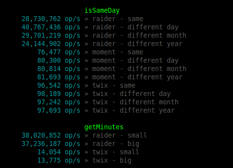

# Raider
##### *Sometimes a new recipe just isn't better*

[](https://travis-ci.org/gastro-instruments/raider) [](https://coveralls.io/github/gastro-instruments/raider?branch=master)

## Why

- Minimal and super fast



- nuff said


## Install
```bash
$ npm install --save @gi/raider
```


## Usage
```javascript
const raider = require('raider');

console.log(raider.getMinutes(new Date(), new Date(2016, 11, 24));
```

## API

### tl;dr
- **raider.isSameDay**(*dateA, dateB*)
- **raider.getMinutes**(*dateA, dateB*)
- **raider.getWeekday**(*date*)
- **new raider.Span**(*dateA, dateB*)
- **span.contains**(*date*)
- **span.inside**(*date*)
- **span.overlaps**(*span*)
- **span.intersection**(*span*)
- **span.xor**(*span*)
- **span.getMinutes**()
- **span.length**()


### raider.isSameDay(dateA, dateB)
Are two dates on the same day?
```javascript
const today = new Date();
const xmas = new Date(2016, 11, 24);

console.log(raider.isSameDay(today, xmas));
//=> true (yaaay)
```


### raider.getMinutes(dateA, dateB)
Get the minutes between two dates.
```javascript
const oneDate = new Date(2016, 3, 21, 8, 53);
const otherDate = new Date(2016, 3, 22, 7, 10);

console.log(raider.getMinutes(oneDate, otherDate));
//=> 1337
```


### raider.getWeekday(date)
Get the weekday of a date. Sunday = 0
```javascript
const date = new Date(2016, 3, 21);
console.log(raider.getWeekday(date));
//=> 4 (thursday)

// Better yet, use the native function for this
console.log(date.getDay());
//=> 4
```


### Spans
```javascript
const date1 = new Date(2016, 0, 4, 9, 0);
const date2 = new Date(2016, 0, 4, 17, 0);

const span = new raider.Span(date1, date2);
```


#### .contains(date)
Does the span contain the date?
```javascript
const date = new Date(2016, 0, 4, 11, 30);
const borderDate = new Date(2016, 0, 4, 9, 0);

console.log(span.contains(date));
//=> true

console.log(span.contains(borderDate));
//=> true
```


#### .inside(date)
Is the date inside the span?
```javascript
const date = new Date(2016, 0, 4, 11, 30);
const borderDate = new Date(2016, 0, 4, 9, 0);

console.log(span.contains(date));
//=> true

console.log(span.contains(borderDate));
//=> false
```


#### .overlaps(span)
Does the span overlap the other?
```javascript
const span1 = new raider.Span(
	new Date(2016, 0, 4, 9, 0),
	new Date(2016, 0, 4, 17, 0)
);

const span2 = new raider.Span(
	new Date(2016, 0, 4, 8, 0),
	new Date(2016, 0, 4, 9, 15)
);

console.log(span1.overlaps(span2));
//=> true
```


#### .intersection(span)
Returns a new Span where both spans intersect
```javascript
const intersection = span1.intersection(span2);
/* = new Span(
		new Date(2016, 0, 4, 9, 0),
		new Date(2016, 0, 4, 9, 15)
	)
*/
```


#### .xor(span)
Returns an array of spans where the intersections have been cut out
```javascript
const xorred = span1.xor(span2);
/* = [
		new Span(
			new Date(2016, 0, 4, 8, 0),
			new Date(2016, 0, 4, 9, 0)
		),
		new Span(
			new Date(2016, 0, 4, 9, 15),
			new Date(2016, 0, 4, 17, 0)
		)
	]
```


#### .getMinutes()
Returns the minutes between the dates in the span
```javascript
console.log(span2.getMinutes());
//=> 75
```


#### .length()
Returns the milliseconds between the dates in the span
```javascript
console.log(span2.length());
//=> 4500000
```
